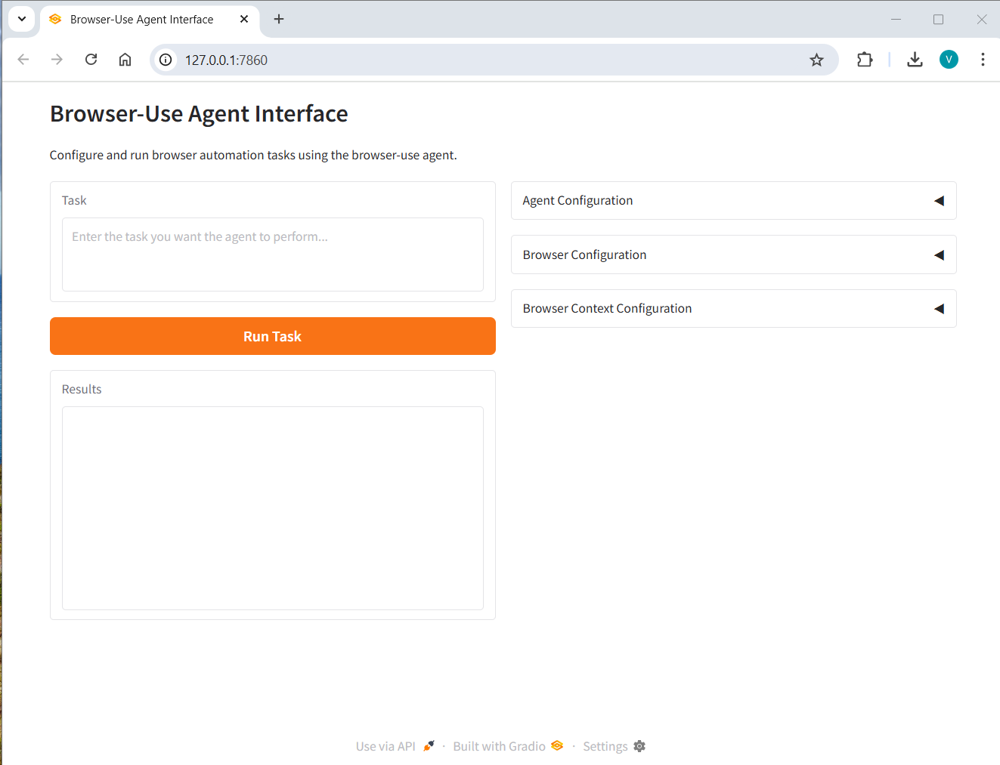

# smartbrowser

SmartBrowser is a User Interface that makes it easier for non-technical users to launch an AI Agent that can perform tasks on the web by using a browser like a human.
It is powered by the [browser-use](https://github.com/browser-use/browser-use) library.

## Description

SmartBrowser is simply a web page built with [Gradio](https://www.gradio.app/) that serves as a simple interface to browser-use.
It allows you to quickly launch an agent to perform a task on the web.

It looks like the below:

## Installation

## Usage

### Quickstart

1. Describe your task in natural language in the Task text area.
2. Select the model you want to use from the Agent Configuration dropdown menu.
3. Click on run the task to launch the agent. This will open Google Chrome and the agent will start to perform the task.

### Advanced Usage

## Examples

## Technical Details

The goal of this project is to create a simple interface to launch a bot on a task quickly. 
The interface will be a web page built with Gradio.

The goal would be to create text areas, Toggles, Dropdowns menus and sliders to be able to provide values for the various parameters of the main classes of the `browser_use` package.
The relevant classes are :

* The `Agent` class
* The `Browser` class
* The `BrowserConfig` class
* The `BrowserContext` class
* The `BrowserContextConfig` class

We want to interface the relevant parameters of this class and include sensible defaults for the parameters.

The main parameters are:

* For the `Agent` class:

    * The name of the model, `model_name` parameter we want to use. It should default to `claude-3-5-sonnet-latest`
    * The `use_vision` parameter. It should default to `True`
    * The `max_failures` parameter. It should default to `3`
    * The `use_vision` for planner parameter. It should default to `False`
    * The `retry_delay` parameter. It should default to `10`
    * The `max_input_tokens` parameter. It should default to `1024`
    * The `validate_output` parameter. It should default to `False`
    * The `planner_interval` parameter. It should default to `1`

* For the `BrowserConfig` class:

    * The `headless` parameter. It should default to `True`.
    * The `disable_security` parameter. It should default to `False`.

* For the `BrowserContextConfig` class:

    * The `minimum_wait_page_load_time` parameter. It should default to `None`.
    * The `maximum_wait_page_load_time` parameter. It should default to `None`.
    * The `wait_between_actions` parameter. It should default to `None`.
    * The `browser_window_height` parameter. It should default to `None`.
    * The `browser_window_width` parameter. It should default to `None`.
    * The `save_recoring_path` parameter. It should default to `None`.
    * The `save_downloads_path` parameter. It should default to `None`.
    * The `highlight_elements` parameter. It should default to `True`.

    pyinstaller --onefile --hidden-import=pydantic --hidden-import=pydantic-core --hidden-import=pydantic.deprecated.decorator --paths venv/Scripts/python.exe  src/smartbrowser/main.py

    pyinstaller main.spec   